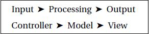
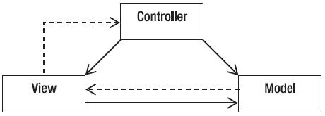

# Introdução ao Padrão MVC

##### Guia do artigo: MVC

- [Introdução ao MVC](https://www.devmedia.com.br/introducao-ao-padrao-mvc/29308#Introducao)
- [História do MVC](https://www.devmedia.com.br/introducao-ao-padrao-mvc/29308#Historia)
- [Padrão de Projeto](https://www.devmedia.com.br/introducao-ao-padrao-mvc/29308#Projeto)
- [O Padrão MVC (Model-View-Controller)](https://www.devmedia.com.br/introducao-ao-padrao-mvc/29308#MVC)
- [Implementação do MVC](https://www.devmedia.com.br/introducao-ao-padrao-mvc/29308#Implementacao)
- [Conclusão](https://www.devmedia.com.br/introducao-ao-padrao-mvc/29308#Conclusao)

------

### Introdução ao MVC

Na fase de Projeto começamos a nos preocupar com a arquitetura da aplicação. Nesta fase damos realmente valor à tecnologia, diferente da fase de análise onde ainda estamos esboçando o problema a ser resolvido. Definimos a plataforma e como os componentes do sistema irão se organizar. Evidentemente que os requisitos ainda são importantes, pois, por exemplo, um sistema Web ou então uma aplicação de tempo real deverá influenciar na arquitetura,

Mesmo não possuindo uma definição consensual, afinal diversos livros, artigos ou autores definem o que é arquitetura da sua forma, a arquitetura de software de um sistema computacional pode ser definida como a suas estruturas, que são compostas de elementos de software, de propriedades externamente visíveis desses componentes, e do relacionamento entre eles. Ou seja, a arquitetura define os elementos de software e como eles interagem entre si.

Para realizar a arquitetura de uma aplicação não basta estar num dia inspirado ou acordar com bastante vontade de realizar uma arquitetura, muito pelo contrário, precisamos de bastante experiência em diferentes organizações, diferentes tipos de projetos, conhecimentos de diferentes arquiteturas, etc. A experiência prática ainda é a melhor solução. O trabalho em equipe também é uma forma excelente de definir uma arquitetura. Muitas vezes, alguns programadores possuem outras experiências ou conhecimentos e a troca dessa experiência é sempre válida, mesmo quando temos um arquiteto bastante experiente na equipe.

A arquitetura de um sistema tem diversos elementos como: elementos utilitários, elementos de interação, elementos que fazem parte do domínio do problema, elementos de conexão, elementos de persistência, etc. Dessa forma, na arquitetura sempre definimos os seus elementos que precisarão ser utilizados no software e como eles se conectam. Uma arquitetura complexa exige mais tempo para desenvolvimento, porém, através de geração automática de aplicações isso pode se tornar mais produtivo. Por isso algumas equipes definem um framework para uma determinada aplicação, assim podemos utilizar muitas coisas pré-prontas que facilitam o desenvolvimento.

No entanto, alguns padrões arquiteturais já foram pensados para resolver problemas corriqueiros. Alguns projetos ou organizações combinam esses padrões arquiteturais, pois atendem melhor às suas necessidades ou deram certo para o seu tipo de aplicação. Por isso é sempre interessante entender as características básicas de cada um dos estilos e escolher ou combinar aqueles que atendem melhor às necessidades de um projeto específico, isso tudo, deve ser feito após uma análise do sistema a ser desenvolvido. Entre as arquiteturas existentes temos: Cliente-servidor, P2P - Peer to Peer, Dados compartilhados, Máquina virtual, Camadas, MVC e muitos outros.

No restante do artigo veremos mais sobre o **padrão arquitetural MVC (Model-View-Controller)** que é um dos mais antigos e mais utilizados atualmente.

### História do MVC

O artigo apresenta o que é um padrão de projeto e foca seu estudo no modelo Model-View-Controller citando as vantagens e desvantagens na sua utilização. Demonstra e exemplifica como fazer o uso correto das três camadas do **padrão MVC**. Aborda o que deve ser implementado em cada uma destas camadas para proporcionar aos desenvolvedores uma manutenção mais fácil e o possível reaproveitamento de classes e partes do projeto em projetos futuros.

O exemplo prático de uma aplicação desenvolvida para desktop – utilizando a API Swing – com base no modelo MVC é comentado e disponibilizado para o leitor.

O Engenheiro Civil Christopher Alexander criou o que se considera o primeiro padrão de projeto em meados da década de 70. É considerado um padrão de projeto uma solução já testada e documentada que possa resolver um problema específico em projetos distintos. Através do trabalho de Alexander, profissionais da área de desenvolvimento de software utilizaram tais conceitos para iniciar as primeiras documentações de padrões de projetos, tornando-as acessíveis para toda a área de desenvolvimento.

O então funcionário da corporação Xerox PARC, Trygve Reenskaug, iniciou em 1979 o que viria a ser o nascimento do padrão de projeto MVC. A implementação original foi descrita no artigo “Applications Programming in Smalltalk-80: How to use Model-View-Controller”. A ideia de Reenskaug gerou um padrão de arquitetura de aplicação cujo objetivo é separar o projeto em três camadas independentes, que são o modelo, a visão e o controlador. Essa separação de camadas ajuda na redução de acoplamento e promove o aumento de coesão nas classes do projeto. Assim, quando o modelo MVC é utilizado, pode facilitar em muito a manutenção do código e sua reutilização em outros projetos.

Neste contexto, este artigo apresentará conceitos para a utilização do padrão de projeto **Model-View-Controller (MVC)**, suas características e vantagens de uso. Também demonstrará dois pequenos exemplos de projetos **utilizando o padrão MVC**, um desktop e outro web. Além disso, fará uma rápida abordagem sobre o que é um Framework e quais deles podem auxiliar o programador na utilização dos **conceitos MVC** em projetos Web. O padrão DAO terá uma rápida abordagem no artigo, sendo demonstrado em qual camada ele deve ser aplicado quando usado em conjunto com o **modelo MVC**. Ademais, algumas vantagens serão abordadas quando se utiliza um ou mais padrões de projeto em desenvolvimento de software e porque isto se torna uma boa prática.

Acoplamento: é o grau em que uma classe conhece a outra. Se o conhecimento da classe A sobre a classe B for através de sua interface, temos um baixo acoplamento, e isso é bom. Por outro lado, se a classe A depende de membros da classe B que não fazem parte da interface de B, então temos um alto acoplamento, o que é ruim.

Coesão: quando temos uma classe elaborada de forma que tenha um único e bem focado propósito, dizemos que ela tem uma alta coesão, e isso é bom. Quando temos uma classe com propósitos que não pertencem apenas a ela, temos uma baixa coesão, o que é ruim.

### Padrão de Projeto

Alexander descreveu um padrão como sendo um problema que se repete inúmeras vezes em um mesmo contexto e que contenha uma solução para resolver tal problema de modo que esta solução possa ser utilizada em diversas situações. O termo padrões de projeto ou Design Patterns, descreve soluções para problemas recorrentes no desenvolvimento de sistemas de software orientados a objetos. O Factory é um destes padrões. Ele é baseado em uma interface para criar objetos e deixar que suas subclasses decidam que classe instanciar. Deste modo, utilizasse o conceito de fábrica de objetos quando um objeto é utilizado para a criação de outros objetos. Algo assim foi implementado no Framework Hibernate para a criação de uma espécie de fábrica de sessões, ou seja, na criação de uma única SessionFactory teríamos acesso a vários objetos do tipo Session.

Padrões de projeto são estabelecidos por um nome, problema, solução e consequências. O nome deve ser responsável por descrever o problema, a solução e as consequências. Quando alguém na equipe de um projeto se refere a um padrão pelo nome, os demais membros da equipe devem relacionar este nome com um problema encontrado, a solução e as consequências na utilização de tal padrão. Encontrar um nome para um novo padrão é considerada uma etapa difícil, já que o nome deve proporcionar a ideia para a qual o padrão foi criado. O problema descreve quando devemos aplicar o padrão, qual o problema a que se refere e seu contexto. A solução descreve os elementos que fazem parte da implementação, as relações entre os elementos, suas responsabilidades e colaborações. Uma solução não deve descrever uma implementação concreta em particular e sim proporcionar uma descrição abstrata de um problema e como resolvê-lo. As consequências são os resultados, vantagens e desvantagens ao utilizar o padrão. São importantes para avaliar as alternativas descritas bem como proporcionar uma ideia de custos e benefícios ao aplicá-lo.

Um exemplo existente e muito utilizado de padrão é o Data Access Object, ou simplesmente DAO. Foi uma solução encontrada para resolver problemas referentes à separação das classes de acesso a banco de dados das classes responsáveis pelas regras de negócio. Já o **conceito principal do modelo MVC é utilizar uma solução já definida para separar partes distintas do projeto reduzindo suas dependências ao máximo**.

Desenvolver uma aplicação utilizando algum padrão de projeto pode trazer alguns dos seguintes benefícios:

- Aumento de produtividade;
- Uniformidade na estrutura do software;
- Redução de complexidade no código;
- As aplicações ficam mais fácies de manter;
- Facilita a documentação;
- Estabelece um vocabulário comum de projeto entre desenvolvedores;
- Permite a reutilização de módulos do sistema em outros sistemas;
- É considerada uma boa prática utilizar um conjunto de padrões para resolver problemas maiores que, sozinhos, não conseguiriam;
- Ajuda a construir softwares confiáveis com arquiteturas testadas;
- Reduz o tempo de desenvolvimento de um projeto.

Nos dias atuais existem diversos padrões e cada um possui uma função bem específica dentro da estrutura do projeto. Deste modo podemos sem problema algum utilizar em um mesmo projeto de software mais de um padrão simultaneamente. Poderíamos fazer uso simultâneo, por exemplo, de padrões como o Factory, para criar uma fabrica de sessões com o banco de dados, o DAO para separar as classes de CRUD das regras de negócios e o **MVC para dividir e diminuir a dependência entre módulos do sistema**.

CRUD: A sigla tem origem na língua inglesa para Create, Retrieve, Update e Delete, em português teria o significado de Criar, Recuperar, Atualizar e Excluir. São as quatro operações básicas em um banco de dados.

### O Padrão MVC (Model-View-Controller)

**O MVC é utilizado em muitos projetos devido à arquitetura que possui**, o que possibilita a divisão do projeto em camadas muito bem definidas. Cada uma delas, o Model, o Controller e a View, executa o que lhe é definido e nada mais do que isso.

A **utilização do padrão MVC** trás como benefício isolar as regras de negócios da lógica de apresentação, a interface com o usuário. Isto possibilita a existência de várias interfaces com o usuário que podem ser modificadas sem que haja a necessidade da alteração das regras de negócios, proporcionando assim muito mais flexibilidade e oportunidades de reuso das classes.

Uma das características de um padrão de projeto é poder aplicá-lo em sistemas distintos. **O padrão MVC pode ser utilizado em vários tipos de projetos** como, por exemplo, desktop, web e mobile.

A comunicação entre interfaces e regras de negócios é definida através de um controlador, e é a existência deste controlador que torna possível a separação entre as camadas. Quando um evento é executado na interface gráfica, como um clique em um botão, a interface irá se comunicar com o controlador que por sua vez se comunica com as regras de negócios.

Imagine uma aplicação financeira que realiza cálculos de diversos tipos, entre eles os de juros. Você pode inserir valores para os cálculos e também escolher que tipo de cálculo será realizado. Isto tudo você faz pela interface gráfica, que para o **modelo MVC é conhecida como View**. No entanto, o sistema precisa saber que você está requisitando um cálculo, e para isso, você terá um botão no sistema que quando clicado gera um evento.

Este evento pode ser uma requisição para um tipo de cálculo específico como o de juros simples ou juros compostos. Fazem parte da requisição neste caso os valores digitados no formulário, como também a seleção do tipo de cálculo que o usuário quer executar sobre o valor informado. O evento do botão é como um pedido a um intermediador que prepara as informações para então enviá-las para o cálculo. Este intermediador nós chamamos de Controller. O controlador é o único no sistema que conhece o responsável pela execução do cálculo, neste caso a camada que contém as regras de negócios. Esta operação matemática será realizada pelo Model assim que ele receber um pedido do Controller.

O Model realiza a operação matemática e retorna o valor calculado para o Controller, que também é o único que possui conhecimento da existência da camada de visualização. Tendo o valor em “mãos”, o intermediador o repassa para a interface gráfica que exibirá para o usuário. Caso esta operação deva ser registrada em uma base de dados, o Model se encarrega também desta tarefa.

Saiba mais: [Artigo Completo sobre Padrão MVC](https://www.devmedia.com.br/padrao-mvc-java-magazine/21995)

**O padrão arquitetural Model-View-Controller (MVC) é uma forma de quebrar uma aplicação, ou até mesmo um pedaço da interface de uma aplicação, em três partes: o modelo, a visão e o controlador**.

O MVC inicialmente foi desenvolvido no intuito de mapear o método tradicional de entrada, processamento, e saída que os diversos programas baseados em GUI utilizavam. No padrão MVC, teríamos então o mapeamento de cada uma dessas **três partes para o padrão MVC conforme ilustra a imagem abaixo**:

**Figura 1**: Mapeamento das três partes de uma aplicação para o MVC.

A figura abaixo demonstra que a entrada do usuário, a modelagem do mundo externo e o feedback visual para o usuário são separados e gerenciados pelos objetos Modelo (Model), Visão (View) e Controlador (Controller).

**Figura 2**: Objetos utilizados no MVC e suas interações.

Explicando cada um dos objetos do **padrão MVC** tem-se primeiramente o controlador (Controller) que interpreta as entradas do mouse ou do teclado enviado pelo usuário e mapeia essas ações do usuário em comandos que são enviados para o modelo (Model) e/ou para a janela de visualização (View) para efetuar a alteração apropriada. Por sua vez o modelo (Model) gerencia um ou mais elementos de dados, responde a perguntas sobre o seu estado e responde a instruções para mudar de estado. O modelo sabe o que o aplicativo quer fazer e é a principal estrutura computacional da arquitetura, pois é ele quem modela o problema que está se tentando resolver. Por fim, a visão (View) gerencia a área retangular do display e é responsável por apresentar as informações para o usuário através de uma combinação de gráficos e textos. A visão não sabe nada sobre o que a aplicação está atualmente fazendo, tudo que ela realmente faz é receber instruções do controle e informações do modelo e então exibir elas. A visão também se comunica de volta com o modelo e com o controlador para reportar o seu estado.

Tão importante quanto explicar cada um dos **objetos do padrão arquitetural MVC** é explicar como é o seu fluxo tipicamente. Primeiramente o usuário interage com a interface (por exemplo, pressionando um botão) e o controlador gerenciar esse evento de entrada da interface do usuário. A interface do usuário é exibida pela visão (view), mas controlada pelo controlador. O controlador não tem nenhum conhecimento direto da View, ele apenas envia mensagens quando ela precisa de algo na tela atualizado. O controlador acessa o modelo, possivelmente atualizando ela de forma apropriada para as ações do usuário (por exemplo, o controlador solicita ao modelo que o carrinho de compras seja atualizado pelo modelo, pois o usuário incluiu um novo item). Isto normalmente causa uma alteração no estado do modelo tanto quanto nas informações. Por fim, a visão usa o modelo para gerar uma interface com o usuário apropriada. A visão recebe as informações do modelo. O modelo não tem conhecimento direto da visão. Ele apenas responde a requisições por informações de quem quer que seja e requisita por transformações nas informações feitas pelo controlador. Após isso, o controlador, como um gerenciador da interface do usuário, aguarda por mais interações do usuário, onde inicia novamente todo o ciclo.

Portanto, a **principal ideia do padrão arquitetural MVC é a separação dos conceitos** - e do código. **O MVC é como a clássica programação orientada a objetos**, ou seja, criar objetos que escondem as suas informações e como elas são manipuladas e então apresentar apenas uma simples interface para o mundo. Entre as diversas **vantagens do padrão MVC** estão a possibilidade de reescrita da GUI ou do Controller sem alterar o nosso modelo, reutilização da GUI para diferentes aplicações com pouco esforço, facilidade na manutenção e adição de recursos, reaproveitamento de código, facilidade de manter o código sempre limpo, etc.

### Implementação do MVC

Existem diversos [frameworks para Java](https://www.devmedia.com.br/artigo-java-magazine-66-construindo-frameworks-em-java/12304) que **implementam o padrão MVC** e são muito utilizados em diversos projetos. Entre eles temos o [JSF](https://www.devmedia.com.br/java-server-faces-jsf-desenvolvimento-de-aplicacoes-web/31026), Struts 1 e Struts 2, [Spring MVC](https://www.devmedia.com.br/java-spring-mvc-criando-aplicacoes-web-em-java/31521), [Play Framework](https://www.devmedia.com.br/conhecendo-o-play-framework-para-java/26655), Tapestry, e diversos outros. Existem diversos artigos e sites especializados que comparam as diferenças e vantagens entre esses diferentes frameworks. No entanto, o melhor é sempre verificar o que cada framework disponibiliza para os desenvolvedores e analisar se ele atende às nossas expectativas.

Outras linguagens/plataformas também possuem frameworks que aderem ao padrão arquitetural MVC. Isso não inviabiliza que uma equipe crie o seu próprio framework, mas é preciso lembrar que um desenvolvedor novo precisa de tempo para aprender a desenvolver em determinada arquitetura e caso a empresa/projeto já utilize um framework bastante popular a curva de aprendizado será bem menor ou praticamente nula. Isso inclusive ajuda na contratação de novos funcionários, onde a empresa já pode exigir como pré-requisito conhecimentos neste framework.

### Conclusão

Neste artigo, vimos o que é a arquitetura de software, quais são seus elementos, o que são as suas interações. Também vimos mais detalhadamente o padrão de arquitetura de software MVC (Model-View-Controller) que é muito utilizado nos projetos de software. Analisamos os seus elementos e como eles interagem entre sí e, além disso, vimos as principais vantagens de adotar um padrão como o MVC que se caracteriza pela facilidade na obtenção de múltiplas visões dos mesmos dados, desacoplar a interface da lógica da aplicação, entre outras vantagens. No entanto, vimos que definir a arquitetura de um software é ainda mais do que escolher o seu padrão arquitetural, precisamos definir a tecnologia (J2EE ou .Net), linguagens a integrar, forma de persistência, interfaces com o usuário e muito mais. Dessa forma, devemos sempre reunir o máximo de pessoas experientes possíveis, conhecimentos, análise do projeto, todos os seus requisitos funcionais e não funcionais, afim de definirmos a melhor arquitetura possível para o software que está sendo desenvolvido.

#### Links Úteis sobre MVC

- [O que é MVC?](https://www.devmedia.com.br/curso/o-que-e-mvc/1492):
  MVC é atualmente o padrão arquitetural mais utilizado no desenvolvimento web, portanto seu conhecimento é fundamental para a construção de projetos bem estruturados.
- [Spring MVC: Construa aplicações responsivas com Bootstrap](https://www.devmedia.com.br/spring-mvc-construa-aplicacoes-responsivas-com-bootstrap/32178):
  Desenvolva aplicações responsivas integrando o framework web da Spring com o Bootstrap, uma das bibliotecas de front-end mais conhecidas.
- [ASP.NET MVC](https://www.devmedia.com.br/guia/asp-net-mvc/38190):
  Neste Guia de Referência você encontrará o conteúdo que precisa para aprender a desenvolver aplicações web com o framework ASP.NET MVC e a linguagem C#.

#### Saiba mais sobre MVC ;)

- [JSF - JavaServer Faces](https://www.devmedia.com.br/guia/jsf-javaserver-faces/38322):
  Neste Guia de Referência você encontrará todo o conteúdo que precisa para conhecer o JSF, especificação Java que traz conceitos do padrão MVC e que facilita a construção de interfaces web utilizando componentes.
- [CRUD em PHP e MVC com Busca e Paginação](https://www.devmedia.com.br/exemplo/crud-em-php-e-mvc-com-busca-e-paginacao/37):
  Aprenda a implementar uma busca, paginação e conversão monetária em PHP e MVC.
- [Como implementar o MVC em PHP](https://www.devmedia.com.br/curso/como-implementar-o-mvc-em-php/1927):
  O padrão MVC é amplamente utilizado no desenvolvimento de aplicações web, e saber implementá-lo é importante para trabalhar de forma eficiente com frameworks como CodeIgniter e Laravel, bem como para desenvolver projetos sem depender dessas soluções de terceiros.

Bibliografia:

1. John Dooley. Software Development and Professional Practice. Apress, 2011.
2. [Model-View-Controller](http://msdn.microsoft.com/en-us/library/ff649643.aspx)