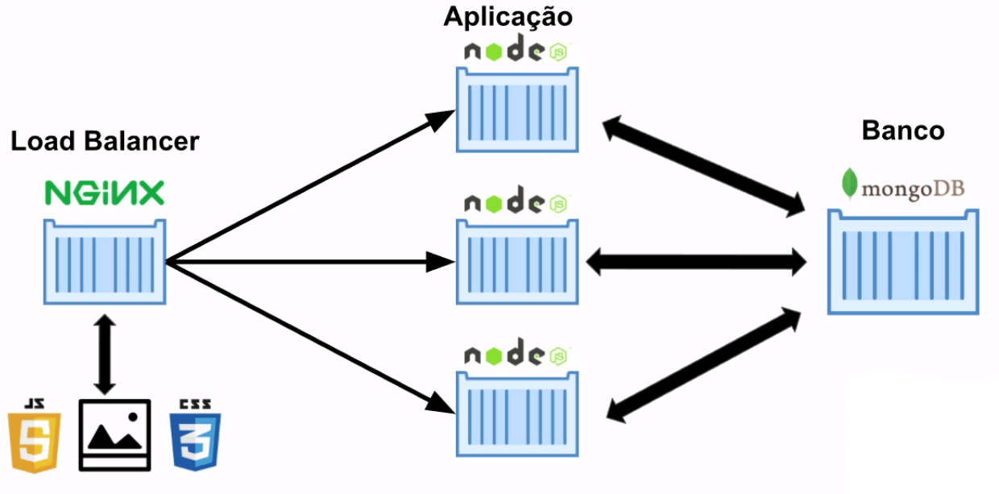

## O problema

Esses dois comandos criam dois *containers*, mas subindo eles desse jeito manual, é muito comum esquecermos de passar alguma *flag*, ou subir o *container* na ordem errada, sem a devida rede, ou seja, é um trabalho muito manual e facilmente suscetível a erros, isso com somente dois *containers*.

Esse modo de subir os *containers* na mão é bom se quisermos criar um ambiente rapidamente, ou são poucos *containers*, mas quando a aplicação começa a crescer, temos que digitar muitos comandos.

## Funcionamento das aplicações em geral

Na vida real, sabemos que a aplicação é maior que somente dois *containers*, geralmente temos dois, três ou mais *containers* para segurar o tráfego da aplicação, distribuindo a carga. Além disso, temos que colocar todos esses *containers* para se comunicar com o banco de dados em um outro *container*, mas quanto maior a aplicação, devemos ter mais de um *container* para o banco também.

E claro, se temos três aplicações rodando, não podemos ter três endereços diferentes, então nesses casos utilizamos um *Load Balancer* em um outro *container*, para fazer a distribuição de carga quando tivermos muitos acessos. Ele recebe as requisições e distribui para uma das aplicações, e ele também é muito utilizado para servir os arquivos estáticos, como imagens, arquivos CSS e JavaScript. Assim, a nossa aplicação controla somente a lógica, as regras de negócio, com os arquivos estáticos ficando a cargo do *Load Balancer*:

Se formos seguir esse diagrama, teríamos que criar cinco *containers* na mão, e claro, cada *container* com configurações e *flags* diferentes, além de termos que nos preocupar com a ordem em que vamos subi-los.

## Docker Compose

Ao invés de subir todos esses *containers* na mão, o que vamos fazer é utilizar uma tecnologia aliada do Docker, chamada **Docker Compose**, feito para nos auxiliar a orquestrar melhor múltiplos *containers*. Ele funciona seguindo um arquivo de texto **YAML** (extensão **.yml**), e nele nós descrevemos tudo o que queremos que aconteça para subir a nossa aplicação, todo o nosso processo de *build*, isto é, subir o banco, os *containers* das aplicações, etc.

Assim, não precisamos ficar executando muitos comandos no terminal sem necessidade. E esse será o foco desta aula, montar uma aplicação na estrutura descrita anteriormente na imagem, que é uma situação comum no nosso dia-a-dia.

### O Docker Compose pode ser criada através de um pacote npm e escrito em js

---

## Compose no Docker Comandos 

Nessa aula aprendemos:

- A necessidade de usar o *Docker Compose*
- Configurar o build de vários containers através do `docker-compose.yml`
- subir e parar os containers de maneira coordenada com *Docker Compose*

Segue também uma breve lista dos novos comandos utilizados:

- `docker-compose up` - sobe os serviços criados
- `docker-compose down` - para os serviços criados.
- `docker-compose ps` - lista os serviços que estão rodando.
- `docker exec -it alura-books-1 ping node2`- executa o comando `ping node2` dentro do container `alura-books-1`

Segue a lista com os principais comandos utilizados durante o curso:

- Comandos relacionados às informações
  - `docker version` **-** exibe a versão do docker que está instalada.
  - `docker inspect ID_CONTAINER` **-** retorna diversas informações sobre o container.
  - `docker ps` **-** exibe todos os containers em execução no momento.
  - `docker ps -a` **-** exibe todos os containers, independentemente de estarem em execução ou não.

- Comandos relacionados à execução
  - `docker run NOME_DA_IMAGEM` **-** cria um container com a respectiva imagem passada como parâmetro.
  - `docker run -it NOME_DA_IMAGEM` **-** conecta o terminal que estamos utilizando com o do container.
  - `docker run -d -P --name NOME dockersamples/static-site` **-** ao executar, dá um nome ao container e define uma porta aleatória.
  - `docker run -d -p 12345:80 dockersamples/static-site` **-** define uma porta específica para ser atribuída à porta 80 do container, neste caso 12345.
  - `docker run -v "CAMINHO_VOLUME" NOME_DA_IMAGEM` **-** cria um volume no respectivo caminho do container.
  - `docker run -it --name NOME_CONTAINER --network NOME_DA_REDE NOME_IMAGEM` **-** cria um container especificando seu nome e qual rede deverá ser usada.

- Comandos relacionados à inicialização/interrupção
  - `docker start ID_CONTAINER` **-** inicia o container com id em questão.
  - `docker start -a -i ID_CONTAINER` **-** inicia o container com id em questão e integra os terminais, além de permitir interação entre ambos.
  - `docker stop ID_CONTAINER` **-** interrompe o container com id em questão.

- Comandos relacionados à remoção
  - `docker rm ID_CONTAINER` **-** remove o container com id em questão.
  - `docker container prune` **-** remove todos os containers que estão parados.
  - `docker rmi NOME_DA_IMAGEM` **-** remove a imagem passada como parâmetro.

- Comandos relacionados à construção de Dockerfile
  - `docker build -f Dockerfile` **-** cria uma imagem a partir de um Dockerfile.
  - `docker build -f Dockerfile -t NOME_USUARIO/NOME_IMAGEM` **-** constrói e nomeia uma imagem não-oficial.
  - `docker build -f Dockerfile -t NOME_USUARIO/NOME_IMAGEM CAMINHO_DOCKERFILE` **-** constrói e nomeia uma imagem não-oficial informando o caminho para o Dockerfile.

- Comandos relacionados ao Docker Hub
  - `docker login` **-** inicia o processo de login no Docker Hub.
  - `docker push NOME_USUARIO/NOME_IMAGEM` **-** envia a imagem criada para o Docker Hub.
  - `docker pull NOME_USUARIO/NOME_IMAGEM` **-** baixa a imagem desejada do Docker Hub.

- Comandos relacionados à rede
  - `hostname -i` **-** mostra o ip atribuído ao container pelo docker (funciona apenas dentro do container).
  - `docker network create --driver bridge NOME_DA_REDE` **-** cria uma rede especificando o driver desejado.
- Comandos relacionados ao docker-compose
  - `docker-compose build` **-** Realiza o build dos serviços relacionados ao arquivo docker-compose.yml, assim como verifica a sua sintaxe.
  - `docker-compose up` **-** Sobe todos os containers relacionados ao docker-compose, desde que o build já tenha sido executado.
  - `docker-compose down` **-** Para todos os serviços em execução que estejam relacionados ao arquivo docker-compose.yml.