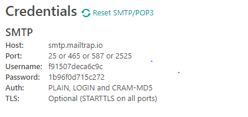
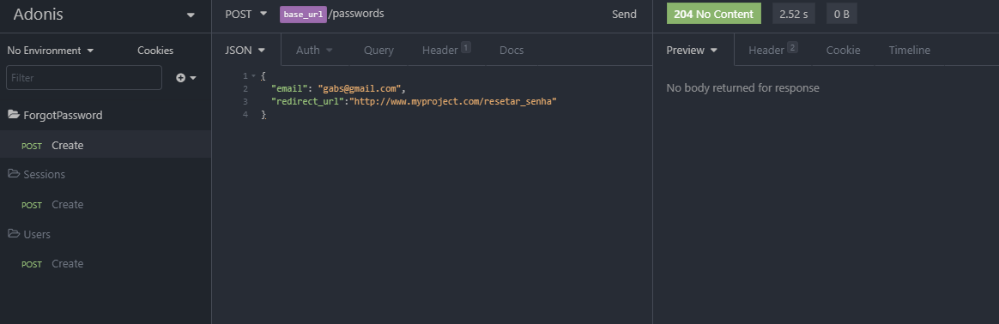

Iniciando no AdonisJS

## Os primeiros passos para com o AdonisJS

- Esse comando mostra todos os projetos que vc pode gerar com o Adonis (Templates prontos)

  ````
  adonis new -h
  ````

- Comando para criar um projeto adonis, o "- - api-only" é o tipo de pacote simples, mas com tudo que irá precisar

  ````
  adonis new myProject --api-only
  ````

- Antes de rodar o servidor é necessário que vc tenha um banco de dados disponível, no arquivo  config/databases.js o adonis disponibiliza diversos bancos pré-configurados para vc utilizar, basta instalar os drivers do mesmo no seu projeto. Nesse exemplo vamos utilizar o postgres, segue o comando que está nesse mesmo arquivo para poder utiliza-lo.

- ````
npm i --save pg
  ````


Depois de ter instalado é necessário que edite o arquivo .env onde estará armazenada as configurações globais da aplicação.

```javascript
DB_CONNECTION=pg
DB_HOST=192.168.99.100
DB_PORT=5432
DB_USER=postgres
DB_PASSWORD=docker
DB_DATABASE=adonis
```

- Coloque o servidor ONLINE, e a opção --dev ativa a funcionalidade do "nodemon", se for usar em produção , rode sem o --dev

  ````javascript
  adonis serve --dev
  ````

- Através de outro terminal, faça a migração das migrations pré-criadas pelo adonis, User and Token

  ````javascript
  adonis migration:run
  ````

- Após obter sucesso, o próximo passo é criar o Controller para fazer as requisições, escolha a opção "HTTP" que aparecerá na linha de comand. Uma pasta Controllers irá ser criada na pasta app do projeto.

  ````javascript
  adonis make:controller User
  ````

  

  Aqui está um exemplo de uma função store no controller

  ```javascript
    'use strict'
  
  const User = use('App/Models/User')
  
  class UserController { async store({request}) { const data = request.only(['username', 'email', 'password'])
    const user = await User.create(data)
  
    return user
  	}
  }
  
  module.exports = UserController
  ```


Nota-se que o códio é bem mais enxuto comparado ao express.

- Depois disso edite o arquivo route.js para criar a Rota

  ````javascript
'use strict'
  
  ````

const Route = use('Route')

  Route.post('users', 'UserController.store')
  ````


### Pronto, vc fez sua primeira inserção de dados na tabela usando AdonisJS.

- Caso queira ver todas as Rotas disponíveis na sua aplicação digite esse comando no terminal.

  ````
  adonis route:list
  ````

- Criando um Token do Usuário, edite o arquivo SessionController depois de executar o comando ( adonis make:controller Session ) e logo após crie a rota.

  

  ````javascript
'use strict'
  
  class SessionController {
    async store ({ request, response, auth }) {
      const { email, password } = request.all();
  
      const token = await auth.attempt(email, password)

      return token
  }
  }
  
  module.exports = SessionController
  ````

  Antes de começar é necessário que já tenha a a funcionalidade de Token pronta na aplicação, como SessionController e etc.

  Caso tenha alguma dúvida olhe o site: https://adonisjs.com/docs/4.1/mail  para obter melhores informações.

  

### Instalando as dependência de e-mails do Adonis.

Digite o seguinte comando no terminal.

```
adonis install @adonisjs/mail
```

Adicione o código abaixo em start/app.js (a ultima linha foi editada adicionando o MailProvider)

```javascript
const providers = [
  '@adonisjs/framework/providers/AppProvider',
  '@adonisjs/auth/providers/AuthProvider',
  '@adonisjs/bodyparser/providers/BodyParserProvider',
  '@adonisjs/cors/providers/CorsProvider',
  '@adonisjs/lucid/providers/LucidProvider',
  '@adonisjs/mail/providers/MailProvider'
]
```

O próximo arquivo a ser editado está localizado em config/mail.js no campo smtp, deixe o campo da seguinte maneira.

```javascript
smtp: {
    driver: 'smtp',
    pool: true,
    port: Env.get('MAIL_PORT'),
    host: Env.get('MAIL_HOST'),
    secure: false,
    auth: {
      user: Env.get('MAIL_USERNAME'),
      pass: Env.get('MAIL_PASSWORD')
    },
    maxConnections: 5,
    maxMessages: 100,
    rateLimit: 10
  },
```


## Utilize o MailTrap para para fazer os testes de envio de Email, acesse o site e faça seu login: https://mailtrap.io/

Edite o arquivo .env da sua aplicação adicionando os seguintes campos e dados passados pelo MailTrap.



Adicione as seguintes linhas de código no arquivo que está na raiz do projeto **".env"** .

````javascript
MAIL_HOST=smtp.mailtrap.io
MAIL_PORT=2525
MAIL_USERNAME=f91507deca6c9c
MAIL_PASSWORD=1b96f0d715c272
````

---

O próximo passo é acessar esse seguinte link onde terá informações sobre Views, para editar melhor seus e-mails:  https://adonisjs.com/docs/4.1/views

Copie o seguinte código substituindo a variável const provider como fizemos em um dos campos anteriores. Deixaremos o seguinte:

````javascript
const providers = [
  '@adonisjs/framework/providers/AppProvider',
  '@adonisjs/auth/providers/AuthProvider',
  '@adonisjs/bodyparser/providers/BodyParserProvider',
  '@adonisjs/cors/providers/CorsProvider',
  '@adonisjs/lucid/providers/LucidProvider',
  '@adonisjs/mail/providers/MailProvider',
  '@adonisjs/framework/providers/ViewProvider'
]
````

---

Adiciona um utilitário no seu vsCode chamado "Edge template support" para poder editar arquivos com extenção .edge

Crie uma pasta na raiz do projeto chamada " resources/views/emails/forgot_password.edge ", nesse aquivo deixaremos o seguinte:

````html
<strong>Recuperação de Senha</strong>

<p>Uma solicitação de recuperação de senha foi realizada para seu e-mail ( {{email}} ).
    Se você não foi o autor dessa requisição, solicitamos a troca de senha imediata. </p>

<p>Para coninuar com a recuperação de senha, Utilize o toke {{token}} ou clique no link abaixo</p>

<a href="{{link}}">Criar nova senha</a>
````

Note que a tag 'a' você deverá inserir o link de formulário de recuperação de senha da sua aplicação passando o token como parametro de autenticação.

---

Nosso ForgotPasswordController ficou da seguinte maneira:

````javascript
'use strict'
    
    const crypto = require('crypto')
    const User = use('App/Models/User')
    const Mail = use('Mail')
    
    class ForgotPasswordController {
      async store ({ request, response }) {
        try {
          const email = request.input('email')   //utilize input quando precisar buscar um único parametro
          const user = await User.findByOrFail('email', email)
    
          user.token = crypto.randomBytes(10).toString('hex')
          user.token_created_at = new Date()
    
          await user.save()
    
          await Mail.send(
            //No Array adiante vc pode inserir mais de um aquivo somente de texto para o usuário, para evitar que seu dominio ploqueie qualquer tipo de email.
            ['emails.forgot_password'],
            //Nas chaves adiante, estamos adicionando as variaveis que passaremos como parametro, o token por exemplo, para ele entrar no formulário já autenticado.
            //Em redirect_url o front end irá adicionar o endereço do formulário de recuperação de senha
            {
              email,
              token: user.token,
              link: `${request.input('redirect_url')}?token=${user.token}`},
            message => {
            message
              .to(user.email)
              .from('teste@gmail.com', 'Email de Teste')
              .subject(`Recuperação de senha do ${user.name}`)
          })
    
        } catch (error) {
          return response.status(error.status).send({ error: { message: 'Algo não deu certo, esse e-mail existe?' }})
        }
      }
    }
    
    module.exports = ForgotPasswordController
````

Pronto!  Reinicia seu servidor e faça o teste usando o insomnia.



