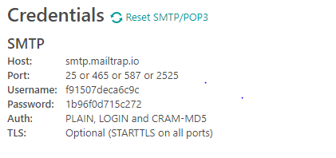
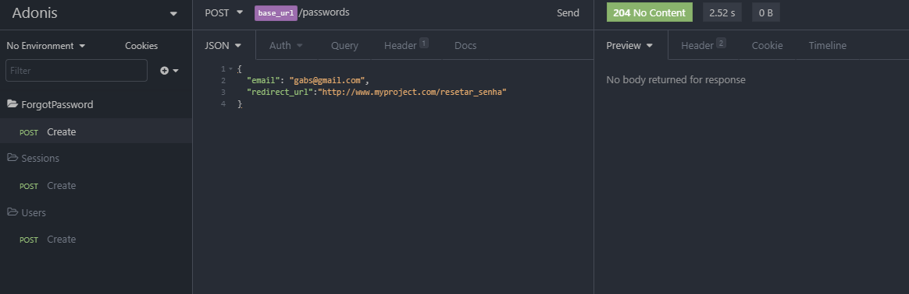

# Send Mail para recuperar Senha com AdonisJS

Antes de começar é necessário que já tenha a a funcionalidade de Token pronta na aplicação, como SessionController e etc.

Caso tenha alguma dúvida olhe o site: https://adonisjs.com/docs/4.1/mail  para obter melhores informações.

### Instalando as dependência de e-mails do Adonis.

Digite o seguinte comando no terminal.

```
adonis install @adonisjs/mail
```

Adicione o código abaixo em start/app.js (a ultima linha foi editada adicionando o MailProvider)

```javascript
const providers = [
  '@adonisjs/framework/providers/AppProvider',
  '@adonisjs/auth/providers/AuthProvider',
  '@adonisjs/bodyparser/providers/BodyParserProvider',
  '@adonisjs/cors/providers/CorsProvider',
  '@adonisjs/lucid/providers/LucidProvider',
  '@adonisjs/mail/providers/MailProvider'
]
```

O próximo arquivo a ser editado está localizado em config/mail.js no campo smtp, deixe o campo da seguinte maneira.

```javascript
smtp: {
    driver: 'smtp',
    pool: true,
    port: Env.get('MAIL_PORT'),
    host: Env.get('MAIL_HOST'),
    secure: false,
    auth: {
      user: Env.get('MAIL_USERNAME'),
      pass: Env.get('MAIL_PASSWORD')
    },
    maxConnections: 5,
    maxMessages: 100,
    rateLimit: 10
  },
```

## Usando o MailTrap

Utilize o MailTrap para para fazer os testes de envio de Email, acesse o site e faça seu login: https://mailtrap.io/

Edite o arquivo .env da sua aplicação adicionando os seguintes campos e dados passados pelo MailTrap.



Adicione as seguintes linhas de código no arquivo que está na raiz do projeto **".env"** .

```javascript
MAIL_HOST=smtp.mailtrap.io
MAIL_PORT=2525
MAIL_USERNAME=f91507deca6c9c
MAIL_PASSWORD=1b96f0d715c272
```

---

O próximo passo é acessar esse seguinte link onde terá informações sobre Views, para editar melhor seus e-mails:  https://adonisjs.com/docs/4.1/views

Copie o seguinte código substituindo a variável const provider como fizemos em um dos campos anteriores. Deixaremos o seguinte:

```javascript
const providers = [
  '@adonisjs/framework/providers/AppProvider',
  '@adonisjs/auth/providers/AuthProvider',
  '@adonisjs/bodyparser/providers/BodyParserProvider',
  '@adonisjs/cors/providers/CorsProvider',
  '@adonisjs/lucid/providers/LucidProvider',
  '@adonisjs/mail/providers/MailProvider',
  '@adonisjs/framework/providers/ViewProvider'
]
```

---

Adiciona um utilitário no seu vsCode chamado "Edge template support" para poder editar arquivos com extenção .edge

Crie uma pasta na raiz do projeto chamada " resources/views/emails/forgot_password.edge ", nesse aquivo deixaremos o seguinte:

```html
<strong>Recuperação de Senha</strong>

<p>Uma solicitação de recuperação de senha foi realizada para seu e-mail ( {{email}} ).
    Se você não foi o autor dessa requisição, solicitamos a troca de senha imediata. </p>

<p>Para coninuar com a recuperação de senha, Utilize o toke {{token}} ou clique no link abaixo</p>

<a href="{{link}}">Criar nova senha</a>
```

Note que a tag 'a' você deverá inserir o link de formulário de recuperação de senha da sua aplicação passando o token como parametro de autenticação.

---

Nosso ForgotPasswordController ficou da seguinte maneira:

```javascript
'use strict'

    const crypto = require('crypto')
    const User = use('App/Models/User')
    const Mail = use('Mail')

    class ForgotPasswordController {
      async store ({ request, response }) {
        try {
          const email = request.input('email')   //utilize input quando precisar buscar um único parametro
          const user = await User.findByOrFail('email', email)

          user.token = crypto.randomBytes(10).toString('hex')
          user.token_created_at = new Date()

          await user.save()

          await Mail.send(
            //No Array adiante vc pode inserir mais de um aquivo somente de texto para o usuário, para evitar que seu dominio ploqueie qualquer tipo de email.
            ['emails.forgot_password'],
            //Nas chaves adiante, estamos adicionando as variaveis que passaremos como parametro, o token por exemplo, para ele entrar no formulário já autenticado.
            //Em redirect_url o front end irá adicionar o endereço do formulário de recuperação de senha
            {
              email,
              token: user.token,
              link: `${request.input('redirect_url')}?token=${user.token}`},
            message => {
            message
              .to(user.email)
              .from('teste@gmail.com', 'Email de Teste')
              .subject(`Recuperação de senha do ${user.name}`)
          })

        } catch (error) {
          return response.status(error.status).send({ error: { message: 'Algo não deu certo, esse e-mail existe?' }})
        }
      }
    }

    module.exports = ForgotPasswordController
```

Pronto!  Reinicia seu servidor e faça o teste usando o insomnia.



## Update da Senha

Beleza, agora o próximo passo é fazermos o update no controller para efetivar a alteração de senha.

No arquivo **ForgotPasswordController.js** iremos adicionar a função update.

```javascript
async update ({ request, response }) {
    try {
    
    }catch {
        return response.status(error.status).send({ error: { message: 'Algo deu errado ao resetar sua senha' }})
    }
}
```

> Já adicionamos tbm a mensagem de erro caso o try não funcione.

Para não esqucer vamos tbm adicionar a rota em 'start/routes.js' de acardo com meu arquivo, ficará assim:

```javascript
'use strict'

const Route = use('Route')

Route.post('users', 'UserController.store')

Route.post('sessions', 'SessionController.store')

Route.post('passwords', 'ForgotPasswordController.store')
Route.put('passwords', 'ForgotPasswordController.update')
```

Vamos deixar nosso insomnia pronto para fazer a requisição, ficará da seguinte Maneira:


> Note que o campo token: se refere ao que está armazedo no usuário, no campo que ciramos depois de alterar sua migration, adicionado o token e token_created_at.

---

Agora vamos adicionar um pacote para manipular datas no adonis 

```js
npm install moment //(Tipo o date-fns)
```

---

Voltando para o ***ForgotPasswordController***.js após o Try colocaremos o seguinte código:

```javascript
try {
      const { token, password } = request.all() //Pegando todas os valores passados no corpo da requisição

      const user = await User.findByOrFail('token', token)

      //Verifica se faz mais de dois dias que essa requisição foi feita, se sim, ela é negada
      const tokenExpired =  moment()
        .subtract('2','days') //Nessa função os paramentros são a qauntidades de dias que vc está subtraindo da data atual
        .isAfter(user.token_created_at) //irá comparar com o valor da data do created_at

        if(tokenExpired){
          return response.status(401).send({ error: { message: 'Token expirado.' }})
        }

        user.token = null
        user.token_created_at = null
        user.password = password

        await user.save()

    }
```

Pronto, agora podemos testar se a requisição está sendo feita corretamente. Utilize o insomnia que já deixamos pronto para fazer o Update da senha e Voalá. senah alterada com sucesso. 