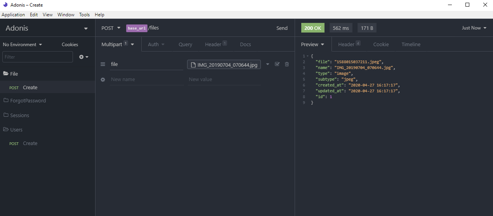
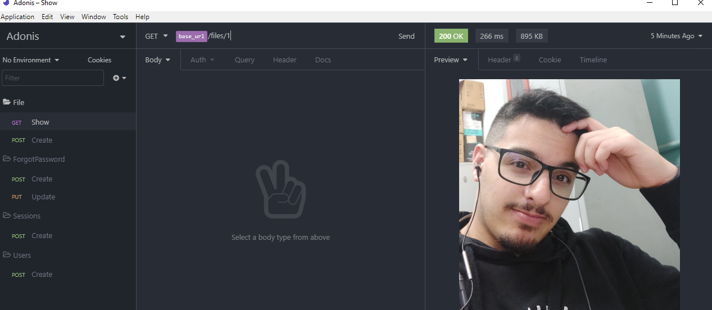

# Upload de arquivos no Adonis e Visualização

## Criando os arquivos de Model e Controller

Para que possamos montar nosso Model e Controller, podemos executar o seguinte comando:

```
adonis make:model File -m -c
```

Esse comando cria o Model, Migrations e o Controller de File.

---

## Editando Migration

Dentro de database, onde estão localizadas as migrations, a ultima que adicionamos foi a de File logo a cima. Agora editaremos esse arquivo com o seguinte código:

```js
'use strict'

/** @type {import('@adonisjs/lucid/src/Schema')} */
const Schema = use('Schema')

class FileSchema extends Schema {
  up () {
    this.create('files', (table) => {
      table.increments()
      table.string('file').notNullable()
      table.string('name').notNullable()
      table.string('type',20)
      table.string('subtype',20)
      table.timestamps()
    })
  }

  down () {
    this.drop('files')
  }
}

module.exports = FileSchema
```

Depois de inserir o código, execute o comando abaixo para validar e criar a tabela de Files no banco de dados.

```
adonis migration:run
```

---

## Edite o arquivo de Controller

No adonis não é necessário que vc edite o arquivo de Model pois ele já está com a estrutura básica e será alterado as informações e arquivo para o banco assim que a requisição estiver finalizada.

```js
'use strict'

const File = use('App/Models/File')
const Helpers = use('Helpers') //para trabalhhar com funções de ajuda

class FileController {

  async store ({ request, response }) {
    try {
        if(!request.file('file')) return

        const upload = request.file('file', {size: '2mb'})

        const fileName = `${Date.now()}.${upload.subtype}`

        //Pasta que pode ser configurada nas propriedades do Adonis
        await upload.move(Helpers.tmpPath('uploads'), {
          name: fileName
        })

        if(!upload.moved()){
          throw upload.error()
        }

        const file = await File.create({
          file: fileName,
          name: upload.clientName,
          type: upload.type,
          subtype: upload.subtype
        })

        return file

    } catch (error) {
      return response.status(error.status).send({ error: { message: 'Error ao fazer o upload do arquivo'}})
    }
  }

}

module.exports = FileController
```

Antes de testar esta rota, vc deverá criar ela no arquivo de routes.js

```js
Route.post('/files', 'FileController.store')
```

Faça o teste e o json deverá retornar as sucesso, se sim, parabéns!, caso não, procure o erro e jamais desista de aprender!.



---

## Visualiza arquivos através de Rotas

Fazer uma rota que retorne o arquivo para o frontend, inserimos uma nova tora em routes.js

```js
Route.get('/files/:id', 'FileController.show')
```

E em seguida voltamos para o controller para adicionarmos o método show

```js
async show ({ params, response }){
    const file = await File.findOrFail(params.id) //Procurar o id do arquivo no banco

    return response.download(Helpers.tmpPath(`uploads/${file.file}`))
  }
```



---

## URL de acesso

Agora vamos criar a URL de acesso para o frontend usar.

Deixaremos o Model de User desta Maneira:

```js
'use strict'

/** @type {typeof import('@adonisjs/lucid/src/Lucid/Model')} */
const Model = use('Model')
const Env = use('Env')

class File extends Model {
  static get computed() {
    return ['url']
  }

  getUrl ({ id }){
    return `${Env.get('APP_URL')}/files/${id}`
  }
}

module.exports = File
```
