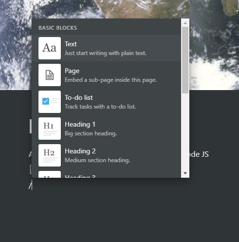

Shortcut suggestion

Hello, I am a juntion developer and I love to use typora for my abstracts, I am a fan of the tool and I would like to request a functionality that would be nice.
A shortcut key for the markdown functions, such as h1, h2, code, etc. as in the image below.

